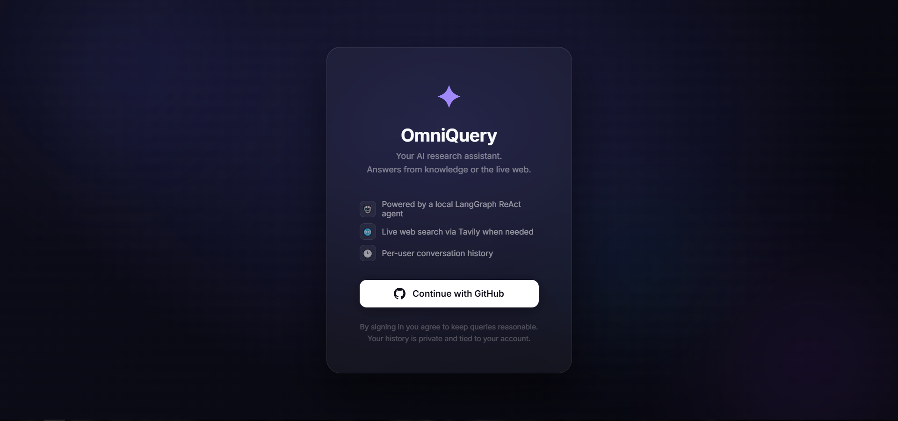

# OmniQuery

> AI-powered web search agent built with a local LLM stack (Ollama + LangChain + LangGraph), featuring a secure ReAct architecture, OAuth 2.0 authentication, robust PII anonymization, and smart context isolation.

---

## 🚀 Overview

OmniQuery is a full-stack, secure AI application that enables users to interact with a smart web search agent. Following a recent major architectural upgrade, the application has evolved from a simple structured graph pipeline into a dynamic **ReAct Agent** pattern.

It leverages local LLMs for query understanding and tool orchestration, maintaining a clean, modular backend designed for enterprise-grade extensibility, security, and scalability.

---

## 🖥️ System Requirements

Running a local LLM and NLP anonymization requires specific hardware capabilities:

- **RAM**: Minimum 16GB (32GB recommended for seamless multitasking).
- **GPU (Optional but highly recommended)**: Running `llama3:8b` via Ollama is significantly faster on a dedicated GPU (e.g., NVIDIA RTX 3060/4060 with 8GB+ VRAM or Apple Silicon M-series). It can run on CPU, but generation will be slow. Older generation GPUs will work too, but will be slower
- **Disk Space**: ~6-8GB for the NLP models and local LLM runtime.

---

## 🧠 Architecture

OmniQuery uses a **LangGraph-powered ReAct workflow** alongside a rigorous FastAPI backend:

- **ReAct Agent** → Dynamically decides whether to rely on internal knowledge or invoke external tools (Web Search).
- **Tools** → Modular capabilities provided to the LLM (e.g., Tavily/SerpAPI web search).
- **Middleware** → Request interception (Profanity Filtering, Session Management).
- **Security & Privacy Layer** → Microsoft Presidio PII anonymization occurs _before_ LLM execution, with de-anonymization applied to the final output.
- **State Management** → Persistent semantic context isolation and conversation caching.

### 🔄 High-Level Flow

```
User Input
   ↓
Auth Verification (GitHub OAuth 2.0)
   ↓
Middleware (Profanity Filter)
   ↓
PII Anonymization (Presidio Analyzer & Anonymizer)
   ↓
Smart Context Isolation (Topic-shift detection)
   ↓
LangGraph ReAct Execution (LLM + Tool calling logic)
   ↓
PII De-anonymization (Restoring original entities)
   ↓
Database Persistence (SQLModel ORM)
   ↓
Frontend Rendering
```

---

## ✨ Key Features (v2.0)

- **ReAct Tool-Calling Agent:** The LLM actively chooses when and how to search the web based on the prompt context rather than relying on static processing nodes.
- **GitHub OAuth 2.0:** Secure, HTTP-only cookie-based session management ensuring strict multi-user data isolation.
- **Advanced Privacy (Data Anonymization):** Automatically detecting, redacting, and restoring sensitive user data (PII) mid-flight, ensuring the LLM never sees raw user secrets.
- **Smart Context Management:** Custom Jaccard-similarity topic-shift detection prevents "entity bleed", isolating unrelated conversational turns dynamically.
- **Local Inferencing Migration:** Optimized to run fully localized workflows utilizing `langchain-ollama` (e.g., `llama3:8b`).
- 🗂️ **Robust Conversation Persistence:** Managed by `SQLModel` ORM mapping to an underlying SQLite database.
- 🗑️ **Conversation Management:** Users have full control to view and permanently delete their isolated chat histories.
- 🌐 **Refined Frontend:** A responsive Vanilla JavaScript UI with dynamic history loading, sleek sidebar integration, and a dedicated callback-handled login interface.

---

## 🔌 API Endpoints

### Agent Interaction

**POST /ask**

Request:

```json
{
  "query": "Who won the NBA finals last year?",
  "conversation_id": "optional-uuid-here"
}
```

Response:

```json
{
  "answer": "The Boston Celtics won the NBA Finals last year...",
  "source": "web_search",
  "conversation_id": "abc-123-uuid"
}
```

---

### History Management

- **GET /history** → Retrieve a list of the current user's past conversations.
- **GET /history/{conversation_id}** → Retrieves stored messages for a specific conversation.
- **DELETE /history/{conversation_id}** → Permanently deletes the selected conversation for the user.

---

## 🛠️ Tech Stack

- **Backend:** FastAPI (Python)
- **Agent Orchestration:** LangGraph + LangChain Core + Ollama
- **Database / ORM:** SQLite + SQLModel (SQLAlchemy 2.0 + Pydantic)
- **Privacy Engine:** Microsoft Presidio (spacy)
- **Authentication:** Authlib (OAuth 2.0 / GitHub), PyJWT
- **Frontend:** HTML, CSS, JavaScript (Vanilla)

---

## 📁 Project Structure

```
OmniQuery/
│── app/                # Core backend logic
│   ├── auth/           # OAuth 2.0 routing and dependencies
│   ├── middleware/     # Custom HTTP layers (Profanity filter, sessions)
│   ├── tools/          # ReAct Tools (e.g., search.py)
│   ├── graph.py        # LangGraph workflow router
│   ├── nodes.py        # Agent execution and Context Isolation
│   ├── anonymizer.py   # Microsoft Presidio implementation
│   ├── database.py     # SQLModel connection and CRUD
│   ├── models.py       # ORM Database schemas
│   ├── main.py         # FastAPI application entry point
│   └── ...
│
│── frontend/           # Static assets (HTML, CSS, JS)
│── run.py              # Application runner
│── requirements.txt    # Project dependencies
│── .env.example        # Environment variable template
```

## 🖥️ UI Preview

### 🔐 Login Gateway



> Secure OAuth 2.0 entry point where users authenticate via GitHub before accessing the agent.

---

### 💬 Chat Interface


> Main interaction screen where users send queries and receive responses from the ReAct AI agent.

---

### 📜 Conversation History Sidebar


> Sidebar displaying past conversations, supporting full session reloading and permanent deletion.

---

### ⚙️ System Flow


> Visual representation of the ReAct sequence execution pathway.

## ⚙️ Setup & Run

### 1. Clone the repository

```bash
git clone https://github.com/Omm28/OmniQuery.git
cd OmniQuery
```

### 2. Configure Environment

Copy the `.env.example` file to create your own configuration:

```bash
cp .env.example .env
```

Your `.env` file must contain these critical variables:

```ini
# LLM Provider (Ollama)
OLLAMA_BASE_URL=http://localhost:11434
OLLAMA_MODEL=llama3.1:8b

# Search Provider Sandbox
TAVILY_API_KEY=your_tavily_key_here
SEARCH_MAX_RESULTS=5

# GitHub OAuth App (Create via GitHub settings)
GITHUB_CLIENT_ID=your_github_client_id
GITHUB_CLIENT_SECRET=your_github_client_secret
GITHUB_REDIRECT_URI=http://localhost:8000/auth/callback

# JWT & Session Security
JWT_SECRET_KEY=your_strong_random_secret_here
```

### 3. Create virtual environment

```bash
python -m venv .venv
.venv\Scripts\activate   # Windows
# or manually source for macOS/Linux: source .venv/bin/activate
```

### 4. Install dependencies & NLP Models

```bash
pip install -r requirements.txt
python -m spacy download en_core_web_lg  # Used for Presidio Anonymization
```

### 5. Run the application

Ensure your local Ollama runtime is active, then execute:

```bash
python run.py
```

---

## 🛠️ Troubleshooting

If you encounter issues during setup or runtime, check these common failure points:

- **Missing SpaCy Model Error:** If `app/anonymizer.py` crashes, you likely forgot to download the space language model. Run `python -m spacy download en_core_web_lg`.
- **Ollama Connection Refused:** The local inference engine cannot be reached. Ensure the Docker container or local application for [Ollama](https://ollama.com/) is running and listening on `http://localhost:11434`. Validate that you have run `ollama run llama3:8b` at least once to pull the model.
- **GitHub Auth Redirect Mismatch:** If login callbacks fail, ensure the URL configured in your GitHub OAuth App settings _exactly_ matches the `GITHUB_REDIRECT_URI` in your `.env` (including the protocol, e.g., `http://localhost:8000/auth/callback`).
- **Images Not Loading in UI:** Ensure you have compiled or stored your static UI preview graphics inside the `assets/` directory explicitly, or removed those blocks if tracking via strict markdown.

---

## 📜 License

This project is unlicensed
