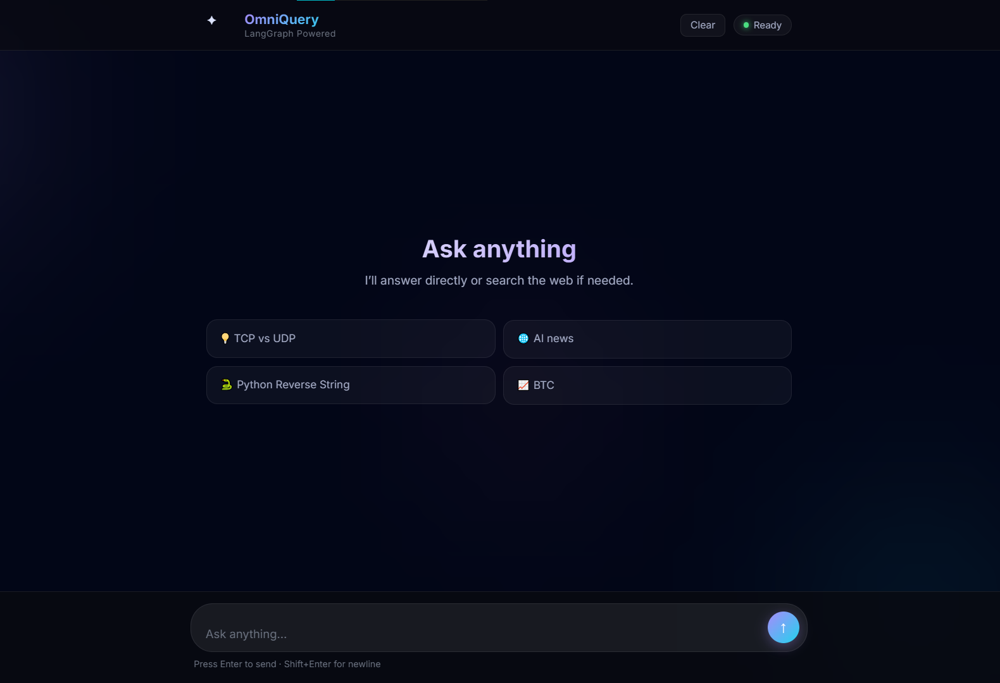
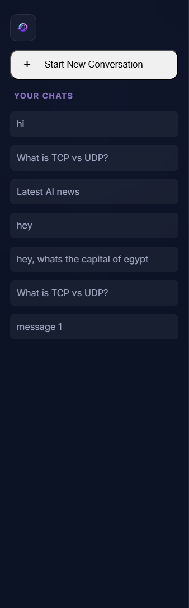
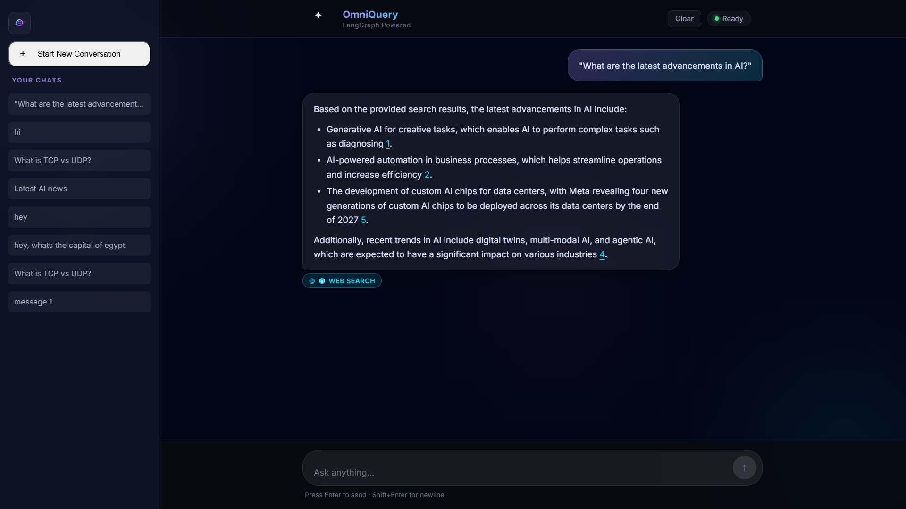
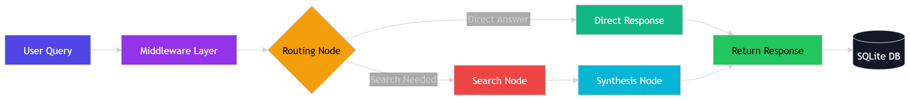

# OmniQuery

> AI-powered web search agent built with a local LLM stack (Ollama + LangGraph), featuring persistent conversations, modular architecture, and a graph-based execution pipeline.

---

## 🚀 Overview

OmniQuery is a full-stack AI application that enables users to interact with a web search agent through a chat interface. It leverages local LLMs for query understanding and response generation, while maintaining a clean, modular backend designed for extensibility and scalability.

The system is built around a **graph-based execution model**, where each user query flows through structured nodes, tools, and middleware for processing.

---

## 🧠 Architecture

OmniQuery uses a **LangGraph-powered workflow** to orchestrate execution:

- **Nodes** → Handle individual steps in query processing
- **Tools** → External capabilities (e.g., search)
- **Middleware** → Intercepts and modifies requests (filters, transformations)
- **State Management** → Maintains conversation context across steps

### 🔄 High-Level Flow

```
User Input
   ↓
Middleware (processing / filtering)
   ↓
LangGraph Execution (nodes + tools)
   ↓
LLM Response Generation
   ↓
Database Persistence (SQLite)
   ↓
Frontend Rendering
```

This design enables:

- Clear separation of concerns
- Easy feature extension (e.g., anonymization, auth layers)
- Scalable transition into agent-based systems

---

## ✨ Current Features

- 💬 Chat-based interface for interacting with the agent
- 🗂️ Conversation persistence using SQLite
- 📜 Sidebar with chat history and session loading
- ⚡ FastAPI backend for API handling
- 🧩 Modular architecture (nodes, tools, middleware)
- 🌐 Frontend built with HTML, CSS, and Vanilla JavaScript

---

## 🔌 API Endpoints

### Chat Interaction

**POST /chat**

Request:

```
{
  "message": "What is AI?"
}
```

Response:

```
{
  "response": "Artificial Intelligence refers to..."
}
```

---

### Conversation History

**GET /chat/{conversation_id}**

Returns stored messages for a given conversation.

---

## 🛠️ Tech Stack

- **Backend:** FastAPI (Python)
- **LLM Orchestration:** LangGraph + Ollama
- **Database:** SQLite
- **Frontend:** HTML, CSS, JavaScript
- **Version Control:** Git

---

## 📁 Project Structure

```
OmniQuery/
│── app/                # Core backend logic
│   ├── middleware/     # Middleware (filters, processing layers)
│   ├── tools/          # External tools (e.g., search)
│   ├── graph.py        # LangGraph workflow
│   ├── nodes.py        # Execution nodes
│   ├── state.py        # State management
│   ├── main.py         # FastAPI entry point
│   └── ...
│
│── frontend/           # UI (HTML, CSS, JS)
│── run.py              # Application runner
│── requirements.txt    # Dependencies
│── .env.example        # Environment variable template
```

## 🖥️ UI Preview

### 💬 Chat Interface



> Main interaction screen where users send queries and receive responses from the AI agent.

---

### 📜 Conversation History Sidebar



> Sidebar displaying past conversations with the ability to reload sessions.

---

### 🔍 Query in Action



> Example of a user query processed through the system with AI-generated output.

---

### ⚙️ System Flow



> Visual representation of how a query moves through middleware, graph execution, and response generation.

## ⚙️ Setup & Run

### 1. Clone the repository

```
git clone https://github.com/Omm28/OmniQuery.git
cd OmniQuery
```

### 2. Create virtual environment

```
python -m venv .venv
.venv\Scripts\activate   # Windows
```

### 3. Install dependencies

```
pip install -r requirements.txt
```

### 4. Run the application

```
python run.py
```

---

## 🧪 Development Status

This project is actively being developed as part of an AI engineering internship.

### 🚧 Upcoming Enhancements

- Transition workflow into a full agent architecture
- OAuth 2.0 authentication
- Integration of ORM for structured database access
- API testing with Postman collections
- Improved version control and release workflow

---

## 📌 Notes

- `.env` is excluded for security — use `.env.example`
- SQLite is used for lightweight local persistence
- Designed to evolve into a production-grade, modular AI system

---

## 📜 License

This project is intended for educational and development purposes.
